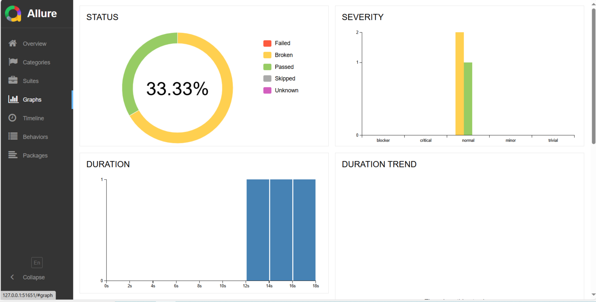

# Selenium Java TestNG Automation Framework
[](https://github.com/enableedge/selenium-java-testng-enableedge)
[](https://github.com/enableedge/selenium-java-testng-enableedge/issues)

This is a Selenium WebDriver automation framework built with Java and TestNG for testing web applications.

## Project Structure

```
src/main/java/
├── com/enableedge/automation/ui/tests/
│   ├── TestBase.java
│   ├── LoginTest.java
│   └── SignUpTest.java
├── com/enableedge/automation/ui/pages/
│   ├── BasePage.java
│   ├── HomePage.java
│   ├── LoginPage.java
│   └── SignUpPage.java
└── com/enableedge/automation/utils/
    ├── CustomLogger.java
    ├── TestDataManager.java
    ├── TestDataUtils.java
    └── ApiUtils.java

src/main/resources/
├── testdata.properties
├── testng.properties
└── allure.properties
```

## Description

This framework is designed to automate both UI and API testing for the Automation Exercise website. It follows the Page Object Model (POM) design pattern for UI automation and uses RestAssured for API testing. The framework includes:
- UI Automation for Login, Signup, and Product pages
- API Automation for various endpoints
- Allure reporting for test results
- TestNG for test execution and management
- Selenium WebDriver for browser automation

## Prerequisites

- Java 17 or higher
- Maven 3.8.0 or higher
- ChromeDriver (for Chrome browser)
- Microsoft Edge Driver (for Edge browser)

## Setup Instructions

1. Install Java 17 or higher
2. Install Maven 3.8.0 or higher
3. Clone this repository
4. Install required browser drivers:
   - ChromeDriver: https://sites.google.com/chromium.org/driver/
   - EdgeDriver: https://developer.microsoft.com/en-us/microsoft-edge/tools/webdriver/

## Running Tests

To run all tests:
```bash
mvn test
```

To run specific test class:
```bash
mvn test -Dtest=LoginTest
```

To run tests with specific browser:
```bash
mvn test -Dtest=LoginTest -Dbrowser=chrome
```

## Test Data

Test data is configured in `src/main/resources/testdata.properties`. The file contains:
- Login credentials
- User information
- Product information

## Reporting

The framework uses Allure for test reporting. Reports will be generated in `target/allure-results` directory.

To view Allure reports:
```bash
allure serve target/allure-results
```

## Logging

The framework uses Log4j2 for logging. Log files are generated in `logs` directory with the following levels:
- INFO
- WARN
- ERROR
- DEBUG

## Getting Started

These instructions will help you set up the project on your local machine for development and testing purposes.

### Installation

1. Clone the repository:
```bash
git clone https://github.com/yourusername/selenium-java-testng-enableedge.git
```

2. Navigate to the project directory:
```bash
cd selenium-java-testng-enableedge
```

3. Install dependencies:
```bash
mvn clean install
```

### Built With

- Java - Programming language
- Selenium WebDriver - Browser automation framework
- TestNG - Testing framework
- RestAssured - API testing library
- Allure - Reporting tool
- Maven - Build tool

### License

This project is licensed under the MIT License - see the LICENSE file for details.
